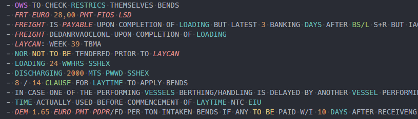

# Chartering Syntax Highlighting for VS Code

## Description

This VS Code extension provides syntax highlighting for important keywords in dry cargo fixture recaps. It aims to make it easier to read and understand chartering documents by highlighting key terms, numbers, and phrases.

## Features

* Highlights numerical values with optional prefixes and suffixes, like `10000MT, 1SB`.
* Highlights quoted strings and legal chartering terms and entities.
* Highlights parameters related to money, costs, payments, laytime etc.
* Highlights words related to voyage details.
* Highlights counterparty related words like account, shipper, and receiver.
* Highlights words related to responsibilities and options.

## Requirements

To make use of this you need to have Visual Studio Code installed on your system. You can download it from [here](https://code.visualstudio.com/).

## Installation

Extension is available on the [Visual Studio Code Marketplace](https://marketplace.visualstudio.com/items?itemName=pavelapekhtin.vscode-chartering-syntax).
Install it from within VS Code by searching for "Chartering Syntax" in the Extensions view (Ctrl+Shift+X).

## Usage

Open a file with the .txt or .recap extension.
The extension should automatically apply the syntax highlighting based on the file extension.
Supported File Extensions are:
`.txt`
`.recap` (which is just a text file with a different extension)

Best is to keep your recap files in a separate folder and open the folder in VS Code. Open VS Code and select File > Open Folder... and select the folder with your recap files.
This way next time you open VS Code, it will remember the folder and you can start working on your recap files right away. (Unless you use VS Code for other projects as well, then you might want to use the File > Open Recent... menu instead.)

## Known Issues

* Some keywords are highlighted partially.
* VSCode complains about extra whitespaces, which should not really be a big issue for recap files since its not a programming language.
* Clauses notation like `1. )` tirgger the unclosed bracket to be bright red.

## Contributing

You can propose new keywords to highlight or any other improvements:

* In the repository discussing section [here](https://github.com/pavelapekhtin/vscode-chartering-syntax/discussions)
* By creating an issue [here](https://github.com/pavelapekhtin/vscode-chartering-syntax/issues).
* At the extension's comment section on the [Visual Studio Code Marketplace](https://marketplace.visualstudio.com/items?itemName=pavelapekhtin.vscode-chartering-syntax).
